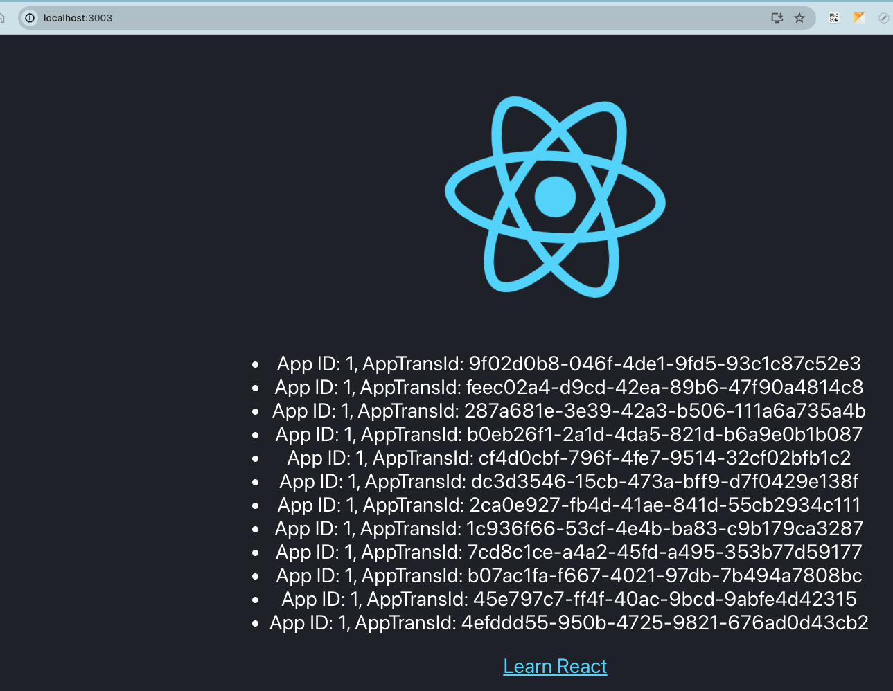

# Golang & React for Server Sent Event

## Overview
**Golang Server** built by [Fiber](https://github.com/gofiber/fiber) to listen API SSE, then response back to clients to update results of Order for example.

**React Client** using [Event Polyfill](https://www.npmjs.com/package/event-source-polyfill) to listen for events which sent by the server

## Quick Start
Run server
```bash
cd server && go run server/main.go
```

Run client
```bash
yarn --cwd "./client" start
```

Result:


